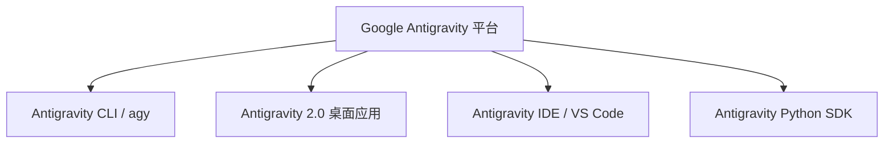

# Google Antigravity (AGY) 官方参考手册

Google Antigravity 是一个 AI 优先的智能体开发平台，支持命令行工具、桌面应用、IDE 插件以及 Python SDK。本手册汇总了各端的核对指南和核心使用方法。

---

## 🗺️ 平台生态版图 (Surfaces)



---

## 💻 1. Antigravity CLI (`agy`) 参考

### 🚀 快速启动与认证
1. 在终端运行命令：
   ```bash
   agy
   ```
2. **身份认证**：首次运行时，在终端按 `Enter` 键即可自动打开浏览器 OAuth 流程。登录 Google 账号后，将获取的验证码复制粘贴回终端即可完成认证。
3. **快捷键**：
   * `ESC`：关闭当前活动菜单（如 `/skills` 或 `/settings`）。
   * `Ctrl+D` 连按两次 (或者输入 `/exit` / `/quit`)：退出当前的 CLI 会话。
   * `Up / Down 方向键`：在输入历史记录中导航。

### 🛠️ 交互式会话命令 (TUI)
在 CLI 交互界面中，可通过以下斜杠命令高效操纵工作区和查看上下文：

| 命令 | 功能描述 |
| :--- | :--- |
| `/context` | 列出当前已加入 Agent 上下文的所有文件和代码符号。 |
| `/diff` | 展示 Agent 对当前工作区代码所做的全部改动（Git Diff）。 |
| `/skills` | 列出当前所有已激活的智能体技能（Skills）。 |
| `/mcp` | 列出当前激活的 Model Context Protocol 服务器及暴露的工具。 |
| `/tasks` | 显示正在运行的后台任务及执行进度。 |
| `/clear` 或 `/new` | 清除终端屏幕和滚动缓存。 |
| `/settings` 或 `/config` | 打开 TUI 图形化配置面板，自定义智能体设置。 |
| `/fork` 或 `/branch` | 将当前对话复制（Fork）到一个新的会话分支中，保留历史。 |
| `/exit` 或 `/quit` | 退出当前 CLI 会话。 |

### ⚙️ 配置文件说明 (`settings.json`)
CLI 的配置文件路径为：`~/.gemini/antigravity-cli/settings.json`。以下为核心配置键值：

| JSON 键名 | 类型 | 说明 | 默认值 |
| :--- | :--- | :--- | :--- |
| `allowNonWorkspaceAccess` | bool | 是否允许智能体读写工作区之外的文件。 | `false` |
| `toolPermission` | string | 工具权限策略（`always-proceed` 自动允许 / `request-review` 询问我）。 | `request-review` |
| `enableTerminalSandbox` | bool | 是否在受限的沙箱环境中运行终端命令，以增强安全性。 | `false` |
| `colorScheme` | string | CLI 的色彩主题（`terminal`, `dark`, `light`）。 | `terminal` |
| `editor` | string | 打开文件时使用的本地编辑器（如 `vim`, `nano`, `auto`）。 | `auto` |
| `model` | string | 当前会话默认的 Gemini 模型。 | `gemini-3.5-flash` |

---

## 📱 2. Antigravity 2.0 桌面应用 (Electron)

Antigravity 2.0 是一款独立的桌面应用，允许在不依赖 IDE 的情况下直接加载、监控和编排智能体。

### 🌟 核心版面设计
* **左侧边栏 (Left Sidebar)**：
  * **New Conversation**：开启全新会话。
  * **Projects**：管理与快速切换不同的工作区和代码仓库。
  * **Scheduled Tasks**：监控和定义一次性延迟定时器或定时任务（Cron）。
  * **Skills & Customizations**：查看和管理规则（Rules）、插件（Plugins）与 MCP 服务器。
* **聊天画布 (Chat Canvas)**：
  * **斜杠工作流**：输入 `/` 调用内置的 Slash 命令来启动各种自动化子智能体（Subagents）。
  * **@ 上下文提及**：输入 `@` 引入特定的代码文件、目录、过往对话历史或终端 session。
  * **媒体输入**：支持将图片、日志等文件直接拖拽或粘贴进聊天区，将其作为上下文输入。
* **辅助面板 (HTML Auxiliary Pane)**：
  * 集中展示当前会话中产生的所有 **Subagents（子智能体）**、**Background Tasks（后台任务）**、**Artifacts（工件/报告）**、**Files Changed（变更文件）** 以及 **Terminals（终端会话）**。

---

## 🎨 3. Antigravity IDE (VS Code 深度集成版)

Antigravity IDE 深度嵌入了您的日常编写环境。它提供了三种 AI 协作模式：

```
┌────────────────────────────────────────────────────────┐
│  AI 协作模式：                                          │
│                                                        │
│  A. 被动（Tab 补全）   B. 局部（Cmd+I 行内命令）  C. 协作（Sidebar 聊天）│
│  └─ 自动补全代码段     └─ 选定行重构、写注释      └─ 完整双人结对编程   │
└────────────────────────────────────────────────────────┘
```

### 1️⃣ 被动模式：Antigravity Tab (智能补全)
* **智能填充**：根据光标上下文、打开的文件及终端报错自动预测下一步代码。
* **双击 Tab 跳转**：预测你的光标移动路径，按 `Tab` 即可瞬间跳转到目标行。
* **自动导包**：在写下新依赖项时，自动在文件顶部追加 `import` 语句。
* **接受方式**：按 `Tab` 采纳整段建议，按 `Esc` 取消，按 `Cmd + →` (Mac) 逐字采纳。

### 2️⃣ 行内命令：Inline Command (`Cmd + I` / `Ctrl + I`)
* **局部修改**：选中代码片段后唤醒，可以实现高精度的代码重构、代码解释或测试编写。
* **局部文档**：快速为类、函数或变量生成注释和 docstring 的最强方式。

### 3️⃣ 协作模式：Sidebar Chat & Agent Mode
* **Sidebar Chat**：在右侧独立面板中向智能体提问，与它讨论架构与实现思路。
* **Agent 模式**：允许智能体自主读取代码、编写测试、运行本地编译命令并调试报错。
* **Visual Diff 视图**：在编辑器中以红/绿形式直观展示智能体生成的代码，方便你一键接受或回滚。

---

## 🐍 4. Antigravity Python SDK 参考

通过 `google-antigravity` 库，你可以用 Python 代码直接控制和监控智能体。

### 📦 安装
```bash
pip install google-antigravity
```
> [!IMPORTANT]
> 该 SDK 依赖于特定平台的底层二进制文件。请务必使用 `pip` 进行安装以保证二进制文件的正确拉取与配置。

### 🚀 快速上手示例
以下是一个在 Python 中异步启动 Agent 并流式获取回复的完整代码：

```python
import asyncio
import sys
from google.antigravity import Agent, LocalAgentConfig, CapabilitiesConfig

async def main():
    # 配置 Agent
    # 默认情况下为安全只读模式。传入 CapabilitiesConfig() 可以赋予写权限（运行命令、编辑文件）
    config = LocalAgentConfig(
        system_instructions="You are an expert assistant for codebase navigation.",
        capabilities=CapabilitiesConfig(),
    )

    # 通过异步上下文管理器启动 Agent
    async with Agent(config) as agent:
        # 发送提示词（返回 response 对象，非阻塞）
        response = await agent.chat("Write a short python script to list files.")

        # 实时流式输出生成的 Token
        async for token in response:
            sys.stdout.write(token)
            sys.stdout.flush()
        print()

if __name__ == "__main__":
    asyncio.run(main())
```

### 🔍 监控内部思考与 Tool 调用
对于高级开发场景，你可以监控 Agent 的思维链或拦截工具调用：

```python
# 实时监控 Agent 的内部思考（Thoughts）
async for thought in response.thoughts:
    print(f"[Thinking] {thought}")

# 实时拦截并监控 ToolCall 事件
async for call in response.tool_calls:
    print(f"[Executing Tool] {call.name} with args: {call.args}")
```

---

## 🌐 5. 官方实时文档链接

如果你需要查找最新的高级 Vertex AI 接入指南、钩子 (Hooks)、插件 (Plugins) 或 Sidecars 开发说明，请参阅官方在线文档：

- 📖 **官方文档主页**: [antigravity.google/docs](https://antigravity.google/docs)
- 🧠 **自定义规则 (Rules)**: [antigravity.google/docs/rules](https://antigravity.google/docs/rules)
- 🔌 **模型上下文协议 (MCP)**: [antigravity.google/docs/mcp](https://antigravity.google/docs/mcp)
- 🔄 **更新日志**: [antigravity.google/changelog](https://antigravity.google/changelog)
